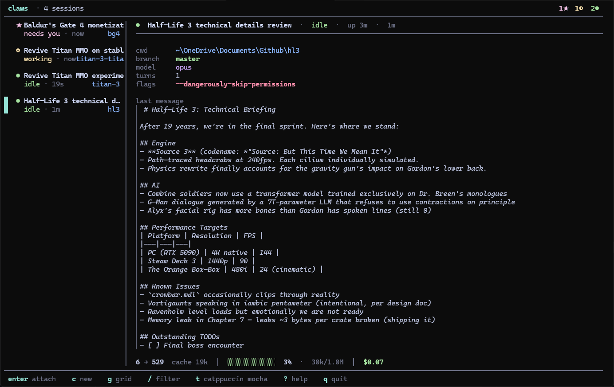

# claws

A terminal UI for running multiple Claude Code sessions at once. One window, all your sessions, switch between them with a keystroke.

If you've ever had three or four `claude` instances open in tmux panes and lost track of which one was waiting on you for a permission prompt, this fixes that.



## What you get

A background daemon that owns each `claude` process inside its own PTY. A TUI client that connects to the daemon and shows all your sessions at once.

The dashboard has a sidebar of sessions on the left and a detail pane on the right. Each entry shows status (idle, working, needs you, exited), how long it's been running, and how recently it was active. The detail pane shows the last message, working directory, current branch (when in a git worktree), model, turn count, token usage, a rough cost estimate, and a context window fill bar.

Hit Enter on a session and you're attached to its full Claude UI, same as if you'd run `claude` in a normal terminal. Ctrl-Space then `d` detaches you back to the dashboard. Sessions stay alive in the background while you're somewhere else.

Press `g` to flip into a grid view — same data, laid out as a wall of session cards. Press `t` to open the theme picker (catppuccin, tokyo night, nord, default, mono — live preview as you arrow through). The top bar shows aggregate state counts (`3● 1◐ 1★`), so you can tell at a glance what every session in the daemon is doing.

## Install

macOS:

```sh
brew install dodontommy/tap/claws
```

Linux:

```sh
curl --proto '=https' --tlsv1.2 -LsSf https://github.com/dodontommy/claws/releases/latest/download/claws-installer.sh | sh
```

Windows (PowerShell):

```powershell
powershell -c "irm https://github.com/dodontommy/claws/releases/latest/download/claws-installer.ps1 | iex"
```

You also need `claude` (the Claude Code CLI itself) on your PATH. claws spawns it as a subprocess.

Once installed, run `claws` to open the dashboard. Run `claws update` any time after that to pull the latest release in place.

## Day-to-day use

`c` opens a spawn form. The default cwd is your most-recently-active session's directory (so you usually just hit Enter to spawn another in the same workspace). As you type a path, the next matching subdirectory shows as ghost text after the cursor — Right-arrow at end of line accepts it. Tab cycles `directory → worktrees → flags → directory`.

If the directory is inside a git repo, the form lists every worktree of that repo. Pick one with the arrow keys + Enter to spawn into it directly. Or hit Enter on `[+ new worktree]` to open a sub-form that runs `git worktree add` for you (default branch name is the repo name with `-2`/`-3`/... appended to dedupe; default path is a sibling directory). If the cwd you typed already has a live session, claws warns you above the worktrees section and offers them as the obvious split.

In the flags field, type whatever you want to pass to `claude` (`--dangerously-skip-permissions`, `--system-prompt "be terse"`, `--effort xhigh`, `--add-dir`, anything). `Ctrl-Y` toggles `--dangerously-skip-permissions` if you don't feel like typing it. Sessions running with that flag get a red `!` in the sidebar so you don't lose track of which ones bypass permission prompts.

`j`/`k` or arrow keys move between sessions in the sidebar. The detail pane updates to show the selected one. `Enter` attaches you to it. Double-click also attaches.

While attached, `Ctrl-Space` is the prefix key (it works the way tmux's `Ctrl-b` does):

- `Ctrl-Space d` detaches back to the dashboard
- `Ctrl-Space n` or `p` cycles to the next or previous session without going through the dashboard
- `Ctrl-Space 1` through `9` jumps directly to session N
- `Ctrl-Space [` enters scroll mode so you can read back through history
- `?` on the dashboard opens the full keymap

Other things you'll want:

- `r` renames a session. The renamed name overrides Claude's auto-generated title.
- `R` kills and immediately resumes a session via `claude --resume`. Useful when Claude gets stuck mid-tool.
- `x` closes and forgets the selected session. Sessions that fail to resume on daemon startup show up as `✗ resume failed` rows; `x` forgets them too.
- `/` filters the list by name, working directory, or title.
- `i` pops up a details view with the full last message and breakdown.
- `g` toggles between sidebar and grid layout.
- `t` opens the theme picker (live preview, esc reverts, enter saves).

## SSH and persistence

This part works the way you'd want. SSH into a server, run `claws`, spawn a few sessions, do some work, disconnect. Sessions keep running on the remote. Come back the next day, SSH back in, `claws` again, everything's still there.

The daemon detaches from the controlling terminal at spawn (`setsid`), so SSH disconnects don't kill it. Its socket lives at `/tmp/claws-<uid>/sock`, which sticks around across logouts.

After a reboot the daemon is gone but the JSONL transcripts that Claude itself writes aren't. On next startup the daemon resumes every session that wasn't explicitly closed by you, calling `claude --resume <session-id>` so the conversation history is intact.

## Stopping the daemon

`q` exits the TUI but leaves the daemon and all sessions running. To actually stop everything:

```sh
claws kill-server
```

## Configuration

There isn't really any. Default colors, keymap baked in, sensible behavior on a fresh install. Per-session settings live alongside the spawn (cwd, flags, name, model) and survive across resumes via a small SQLite file in your local data directory.

If your custom Claude statusLine doesn't expose context window fill in `<n>% used/total` format, claws will fall back to estimating it from token counts and a built-in per-model context limit. The number is approximate but close enough.

## Security

The daemon writes a fresh random auth token to its state directory at startup and rejects any RPC that doesn't include it. Both the Unix socket directory (mode 0700) and the Windows `%LOCALAPPDATA%` ACL keep that token unreadable to other local user accounts. So even on a shared machine, no one else can drive your daemon to spawn `claude` as you. Threat model is documented in [SECURITY.md](SECURITY.md).

## Built with

Rust. ratatui for the UI, portable-pty for cross-platform PTY spawning, vt100 for terminal emulation, interprocess for the local socket, rusqlite for the state store, axoupdater for the in-place updater.

## License

MIT or Apache-2.0, whichever fits your project.
